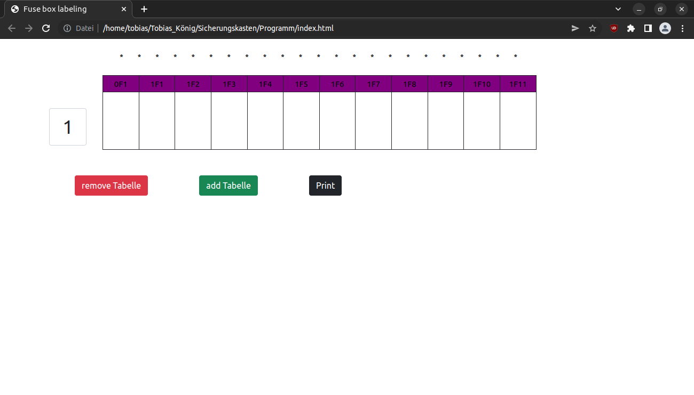

# Fuse box labeling
This application can create and print labels for German fuse boxes to label the fuses

## Table of Contents
* [General Info](#general-information)
* [Technologies Used](#technologies-used)
* [Features](#features)
* [Screenshots](#screenshots)
* [Setup](#setup)
* [Usage](#usage)
* [Project Status](#project-status)
* [Room for Improvement](#room-for-improvement)
* [Acknowledgements](#acknowledgements)
* [Contact](#contact)
*[License](#license)

## General Information
- Improvement for labeling of fuse boxes

## Technologies Used
- Vue.js 3
- Bootstrap 5.1.3

## Features
List the ready features here:
V1:
- Creating and deleting tables
- All table heads are colored in the same color when they belong together
- Automatic tables header fill with entered value
- Print function with the suitable length for german fuse box

## Screenshots

## Setup
requirements:
- You must use a chromium browser
- You need a printer to print the fuse labels

install:
- You only need the Fuse box labeling folder
- You need to change  to  in the Index.html file
- Now you can open the index.html in a chromium browser and use the program

## Usage
You can use it if you want to install a fuse box and clearly name the fuses

## Project Status
Project is: _in progress_

## Room for Improvement
Room for improvement:
- autocomplete funktion
- export and import of tables
- collapse and expand tables
- Dark mode

To do:
- Table with an overview of fuses with number, circuit, rating, fuse and supply line
- customize thead colors better

Bug fixes:

## Acknowledgements
- This project was inspired by my cousin

## Contact
Created by [@TheKing](https://www.discordapp.com/users/270594690313748480) - feel free to contact me!

## License
This project is open source and available under the [MIT License](./LICENSE)

